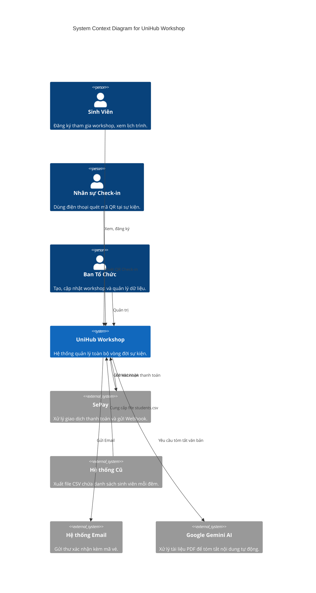
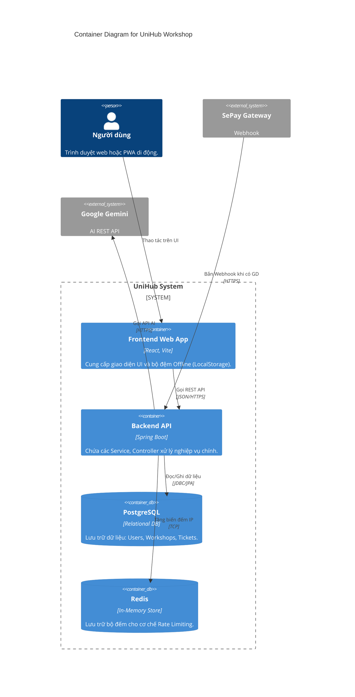
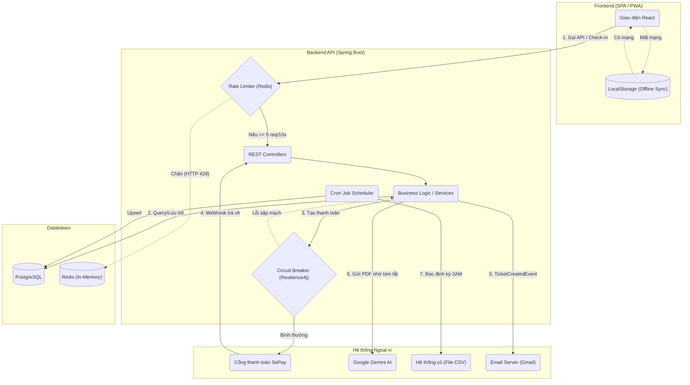

# UniHub Workshop — Technical Design

## Kiến trúc tổng thể
Hệ thống được thiết kế theo kiến trúc **Monolithic Backend kết hợp Single Page Application (SPA / PWA)**. 
- **Frontend**: ReactJS (Vite) + Tailwind CSS. Hoạt động như một Progressive Web App (PWA) cho phép lưu cache và LocalStorage để hỗ trợ chế độ Offline.
- **Backend**: Spring Boot (Java). Chịu trách nhiệm cung cấp RESTful API, xác thực bảo mật JWT, kết nối Database và điều phối các tác vụ ngầm (Background Jobs).
- **Lý do lựa chọn**: Kiến trúc Monolithic phù hợp với quy mô hiện tại của đồ án trường đại học, dễ dàng triển khai (Deploy) và bảo trì. Việc tách rời Frontend và Backend giúp tăng khả năng tái sử dụng (có thể làm thêm Mobile App sau này) và ứng dụng tốt PWA cho yêu cầu Offline.

---

## C4 Diagram

### Level 1 — System Context

### Level 2 — Container

---

## 3. High-Level Architecture Diagram
Sơ đồ dưới đây tập trung diễn giải **luồng dữ liệu, các cơ chế bảo vệ và điểm tích hợp** hệ thống ngoài:

---

## Thiết kế cơ sở dữ liệu
Hệ thống sử dụng **PostgreSQL** (Relational Database) vì dữ liệu của hệ thống có tính quan hệ và ràng buộc chặt chẽ (Ví dụ: Một Vé thuộc về một Sinh Viên và một Workshop). Sự toàn vẹn dữ liệu (ACID) là ưu tiên số một, đặc biệt trong các bài toán giành giật vé.

**Schema các entity chính**:
1. **User**: `id`, `email`, `password`, `fullName`, `studentId`, `role` (ADMIN, STUDENT).
2. **Workshop**: `id`, `title`, `description`, `price`, `totalSeats`, `bookedSpots` (cột thực tế hỗ trợ đếm), `version` (Dùng cho Optimistic Locking), `aiSummary`.
3. **Ticket**: `id`, `ticketCode` (Unique), `user_id`, `workshop_id`, `isScanned`, `paymentStatus`.
   *Ràng buộc đặc biệt*: Có `UniqueConstraint` trên cặp `(user_id, workshop_id)` để đảm bảo một sinh viên không thể lấy 2 vé của cùng 1 workshop.

---

## Mô tả các luồng nghiệp vụ quan trọng

### Luồng 1: Đăng ký workshop có phí & Thanh toán không ổn định
1. Sinh viên bấm "Đăng ký" trên Frontend.
2. Request gọi lên Backend. Backend check số chỗ (`bookedSpots`).
3. Nếu còn chỗ, Backend gọi cơ chế **Circuit Breaker** để tạo mã QR thanh toán SePay.
   - **Bình thường**: Trả về URL mã QR.
   - **Sự cố (Cổng thanh toán sập)**: Fallback kích hoạt, cấp vé cho sinh viên dưới dạng "PENDING" (Thanh toán tại quầy) thay vì quăng lỗi.
4. Sinh viên quét mã QR chuyển tiền. 
5. SePay gửi Webhook về Backend. Backend check Idempotency (xem `ticketCode` đã xử lý chưa).
6. Nếu hợp lệ, tạo vé chính thức, cập nhật DB (có dùng Optimistic Locking để chống kẹt), và kích hoạt Event gửi Email.

### Luồng 2: Check-in khi mất mạng và đồng bộ lại
1. Nhân sự mở trang Check-in. Trình duyệt bắt sự kiện mất WiFi, kích hoạt cờ `isOffline`.
2. Nhân sự quét QR. Frontend chặn việc gọi API, thay vào đó lưu mã vé vào `LocalStorage`. Giao diện vẫn báo thành công để không kẹt hàng.
3. Khi có WiFi lại, `window.addEventListener('online')` kích hoạt.
4. Frontend lôi danh sách vé từ `LocalStorage`, dùng vòng lặp gọi API đồng bộ ngầm lên Server. Xóa bộ nhớ cục bộ sau khi thành công.

### Luồng 3: Nhập dữ liệu từ CSV ban đêm
1. **Spring Scheduler** đánh thức hệ thống lúc 2:00 sáng.
2. Backend đọc file `students.csv`.
3. Duyệt từng dòng bằng `try-catch` (cách ly lỗi). Nếu dòng nào thiếu thông tin thì bỏ qua dòng đó, không làm sập cả file.
4. Thực hiện thuật toán **Upsert**: Quét email/MSSV, có rồi thì cập nhật, chưa có thì tạo mới (Cấp sẵn role STUDENT, password mặc định).

---

## Thiết kế kiểm soát truy cập
Hệ thống sử dụng **RBAC (Role-Based Access Control)** kết hợp với **JWT (JSON Web Token)**.
- **STUDENT**: Có quyền xem workshop, mua vé, xem trang cá nhân.
- **ADMIN**: Có toàn quyền tạo/sửa/xoá Workshop, upload PDF, xem danh sách check-in.
- **Điểm truy cập API**: Các API nhạy cảm được bảo vệ bởi `JwtAuthenticationFilter`. Nó kiểm tra token ở Header, giải mã lấy Role, và chặn các thao tác trái phép (Ví dụ sinh viên không thể gọi API `PUT /admin/...`).
- **Điểm truy cập UI**: React Router dùng Private Route để bọc các trang Admin. Nếu User không mang Role Admin sẽ bị đá văng ra màn hình 404 hoặc Login.

---

## Thiết kế các cơ chế bảo vệ hệ thống

### 1. Kiểm soát tải đột biến (Rate Limiting)
- **Vấn đề**: 12.000 sinh viên F5 API đăng ký vé cùng lúc làm sập DB.
- **Giải pháp**: Dùng **Redis Interceptor**.
- **Cách hoạt động**: Khi request tới API `/api/tickets/register`, Interceptor sẽ bắt lại. Lấy IP làm key (`rate_limit:IP`) và dùng lệnh `INCR` của Redis với vòng đời (TTL) 10 giây.
- **Cơ chế**: Dạng *Fixed Window Counter*. Nếu số đếm > 5, lập tức chặn request, trả về mã 429 Too Many Requests. Do xử lý hoàn toàn trên RAM (Redis) trước khi chạm tới Controller, Database được an toàn tuyệt đối.

### 2. Xử lý cổng thanh toán không ổn định (Circuit Breaker)
- **Vấn đề**: Cổng thanh toán sập kéo theo tính năng đăng ký treo 30 giây (Timeout), làm cạn Connection Pool.
- **Giải pháp**: Dùng thư viện **Resilience4j** với mô hình Circuit Breaker + Graceful Degradation.
- **Cách hoạt động**: Bọc hàm gọi API sinh mã QR bằng `@CircuitBreaker`. Khi ngân hàng sập, Circuit Breaker "mở mạch" (Open). Các request sinh viên sau đó sẽ không gọi ra ngoài nữa mà chạy ngay vào hàm `fallback()`.
- **Graceful Degradation**: Hàm fallback trả về cờ "PAY_AT_COUNTER" (Thanh toán tại quầy). Sinh viên vẫn lấy được chỗ, hệ thống vẫn vận hành bình thường, không bỏ lỡ khách.

### 3. Chống trừ tiền hai lần (Idempotency Key)
- **Vấn đề**: Mạng lag, cổng thanh toán gửi Webhook 2 lần cho cùng 1 hóa đơn, khiến hệ thống cấp 2 vé và chiếm 2 chỗ ngồi.
- **Giải pháp**: Idempotency ở 2 lớp (Database + API).
- **Cách hoạt động**: 
  1. API: Khi nhận Webhook, trích xuất mã vé `ticketCode` (đóng vai trò là Idempotency Key). Truy vấn nhanh DB, nếu đã tồn tại thì `return 200 OK` ngay lập tức để ngắt retry của webhook.
  2. Database: Gắn `@UniqueConstraint` cho cặp `(user_id, workshop_id)`. Kể cả có lọt qua API, DB cũng sẽ block thao tác insert trùng lặp.

### 4. Tranh chấp chỗ ngồi (Concurrency Control)
- **Vấn đề**: 5 sinh viên cùng bấm đăng ký chiếc vé cuối cùng (Slot: 59/60).
- **Giải pháp**: **Optimistic Locking** của JPA/Hibernate.
- **Cách hoạt động**: Gắn `@Version` vào entity `Workshop`. Cả 5 người cùng đọc ra `version=1`. Người thứ nhất lưu thành công, DB nâng lên `version=2`. Bốn người còn lại lưu với `version=1` sẽ bị ném ngoại lệ `ObjectOptimisticLockingFailureException`. Hệ thống bắt lỗi này và hiển thị "Vé cuối cùng đã có người nhanh tay hơn!".
